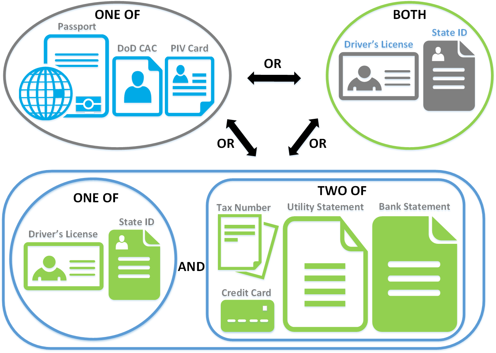

# Attributes and Evidence

Once the identity assurance level for a system or subsystem has been selected, the agency should determine the attributes and identity evidence required to satisfy its use case(s).

The first step to proof an individual is to collect the core attributes necessary to establish a unique representation of the individual’s identity for use during the proofing process. The collection of these core attributes is intended to help resolve applicants to a single unique entity and to enable the appropriate level of verification and validation to support system risk and meet IAL requirements. Some commonly used core attributes are name, date of birth, address, phone number and e-mail address.

Identity evidence comprises physical or digital artifacts used by a subscriber to prove the real-world existence of a claimed identity. Evidence required by the agency and provided by the applicant must contain features that support both validation (confirmed to be genuine and accurate) and verification (demonstrated to associated with the subscriber) at the appropriate strengths for a defined use case.  

It is ultimately up to the agency to determine which biographic information to collect about an applicant to meet identity resolution needs. Caution should be taken in collecting, utilizing, and storing a minimally required set of attributes. Furthermore, in accordance with requirements in 800-63A, notice must be provided to users about what information is collected, why it is collected, and what will be done with it. 

## Types of Evidence

Table 2 provides examples of evidence from each category of strength defined in the aforementioned identity evidence quality table in 800-63A. 

| **Strength** | **Qualities of Identity Evidence** | **Examples** |
| --- | --- | --- |
| Unacceptable | - No acceptable identity evidence provided. | Library Cards |
| Weak |- The issuing source of the evidence did not perform identity proofing. - The issuing process for the evidence means that it can reasonably be assumed to have been delivered into the possession of the applicant. - The evidence contains: - At least one reference number that uniquely identifies itself or the person to whom it relates. OR - The issued identity evidence contains a photograph or biometric template (of any modality) of the person to whom it relates. | Membership or Loyalty Cards Birth Certificate Social Security Card |
| Fair |- The issuing source of the evidence confirmed the claimed identity through an identity proofing process. - The issuing process for the evidence means that it can reasonably be assumed to have been delivered into the possession of the person to whom it relates. - The evidence: - contains at least one reference number that uniquely identifies the person to whom it relates. OR - contains a photograph or biometric template (any modality) of the person to whom it relates. OR - can have ownership confirmed through KBV. - Where the evidence includes digital information, that information is protected using approved cryptographic or proprietary methods, or both, and those methods ensure the integrity of the information and enable the authenticity of the claimed issuing source to be confirmed. - Where the evidence includes physical security features, it requires proprietary knowledge to be able to reproduce it. - The issued evidence is unexpired. | Individual Taxpayer Identification Number Credit or Debit Card Bank Account Statement Utility Account Statement |
| Strong |- The issuing source of the evidence confirmed the claimed identity through written procedures designed to enable it to form a reasonable belief that it knows the real-life identity of the person. Such procedures are subject to recurring oversight by regulatory or publicly-accountable institutions. For example, the Customer Identification Program guidelines established in response to the USA PATRIOT Act of 2001 or the Red Flags Rule, under Section 114 of the Fair and Accurate Credit Transaction Act of 2003 (FACT Act). - The issuing process for the evidence ensured that it was delivered into the possession of the subject to whom it relates - The issued evidence contains at least one reference number that uniquely identifies the person to whom it relates. - The full name on the issued evidence must be the name that the person was officially known by at the time of issuance. Not permitted are pseudonyms, aliases, an initial for surname, or initials for all given names - The: - Issued evidence contains a photograph or biometric template (of any modality) of the person to whom it relates. OR - Applicant proves possession of an AAL2 authenticator, or equivalent, bound to an IAL2 identity, at a minimum. - Where the issued evidence includes digital information, that information is protected using approved cryptographic or proprietary methods, or both, and those methods ensure the integrity of the information and enable the authenticity of the claimed issuing source to be confirmed. - Where the issued evidence contains physical security features, it requires proprietary knowledge and proprietary technologies to be able to reproduce it. - The evidence is unexpired. | Real ID Driver’s License State Identification Card |
| Superior |- The issuing source of the evidence confirmed the claimed identity by following written procedures designed to enable it to have high confidence that the source knows the real-life identity of the subject. Such procedures are subject to recurring oversight by regulatory or publicly accountable institutions. - The issuing source visually identified the applicant and performed further checks to confirm the existence of that person. - The issuing process for the evidence ensured that it was delivered into the possession of the person to whom it relates. - The evidence contains at least one reference number that uniquely identifies the person to whom it relates. - The full name on the evidence must be the name that the person was officially known by at the time of issuance. Not permitted are pseudonyms, aliases, an initial for surname, or initials for all given names. - The evidence contains a photograph of the person to whom it relates. - The evidence contains a biometric template (of any modality) of the person to whom it relates. - The evidence includes digital information, the information is protected using approved cryptographic or proprietary methods, or both, and those methods ensure the integrity of the information and enable the authenticity of the issuing source to be confirmed. - The evidence includes physical security features that require proprietary knowledge and proprietary technologies to be able to reproduce it. - The evidence is unexpired. | FIPS 201 Compliant Personal Identification Verification Card (PIV, PIV-I, and CAC) National Passports Enhanced Driver’s License or Identification |

**Table 2:** Strengths of Identity Evidence

Please note that while examples of unacceptable and weak evidence are presented here for the sake of completeness, agencies should nevertheless be careful in requiring such documents as identity evidence. More detailed information about some of the examples of evidence in Table 2 has been provided in Table 3.

| **Evidence Type** | **Strength** | **Description** |
| --- | --- | --- |
| United States Birth Certificate | Weak | Record that documents the birth of a child in the United States, thus establishing citizenship. Information includes, full name, time and date of birth, city or county of birth, and parents' full names.  |
| Social Security Card | Fair | Card that displays the nine-digit number social security number issued to U.S. citizens, permanent residents, and temporary (working) residents. |
| Enhanced Driver's License (EDL) | Strong | EDL is a card which functions both as driving licence and ID card with limited passport features issued in some states in the United States (Michigan, Minnesota, New York, Vermont, Washington) and some provinces in Canada[2] to people who are both citizens of the country and resident in the relevant region, compliant with the Western Hemisphere Travel Initiative. |
| Department of Defense Common Access Card (CAC) | Strong | A common access card (CAC) is the stadard issue identification document issued to active-duty military personnel and other DoD personnel and is used for multifactor authentication and physical access. The CAC is not capable of holding biometric data. "The CAC enables encrypting and cryptographically signing email, facilitates the use of public key infrastructure (PKI) authentication tools, and establishes an authoritative process for the use of identity credentials." - Smart Card Alliance. Examples are: PIV card, Defense Biometric Identification System (DBIDS) Card |
| Biometric passports that comply with ICAO 9303 (e-passports)  | Strong | The electronic passport, or ePassport, is the same as a traditional passport book with the addition of a small, embedded integrated circuit (i.e., smart card chip).  In the United States and many other countries, the chip is embedded in the back cover. While e-passports are capable of storing biometric template, standard versions only have a digital facial image stored in the chip. As of 2017 over 120 countries are using e-passports. |
| EEA/EU Government issued identity cards that comply with Council Regulation (EC) No 2252/2004 that contain a biometric. | Strong | EU/EEA regulation that requires passport and travels documents meet the specified criteria.  |
| FIPS 201 Compliant PIV Cards | Superior | United States federal smart card that meets the criteria established by FIPS 201 and uses fingerprint templates stored in the chip to make biometric comparisons.  |

**Table 3:** Examples of Identity Evidence

Agencies are cautioned to review guidance on international or common names and the event of a name change while considering evidence for strength. An example selection of evidence documents for an agency to consider in an IAL2 process are shown in the following figure.

**Figure 3** Selecting Evidence

## Collection Techniques

Agencies may use multiple techniques for collecting attributes and evidence in different media. These pertain to digital or other methods of collection that result in the transmission of information from the applicant to the agency. As noted earlier, while the processes laid out in this guide suggest multiple phases of collection, it is possible that agencies or agencies could choose to collect core attributes, additionally required attributes, and evidence during the same event. Multiple techniques may also be combined based on agency requirements, user needs, and the overall approved proofing process flow.

Submitting evidence and attributes in multiple stages can become burdensome for an applicant. It is important to consider collecting the appropriate evidence up-front to avoid requiring the user to perform multiple interactions in order to establish an account. There should be a good balance between executing the proofing process and minimizing the burden on the applicant.

### Digital

The initial information may be captured via an online form directly from the applicant that is being proofed.
In other cases, the agency may allow the applicant to provide some documents via remote means, such as submitting an image of an identification document like a passport or a driver’s license. This workflow requires the utilization of some form of digital capture, such as a camera or a document scanner. Systems with optical character recognition capabilities that allow fields in a document to be pre-populated upon scanning should also allow the applicant to review and validate the information as correct. Some agencies may choose to enforce requirements more directly by providing mobile applications for collection –e.g. camera capture functions that provide an overlay and illumination check feature to ensure applicants provide pictures with correct size and brightness.

Some of the methods with which an agency can digitally capture evidence are listed in Table 3.

| **Method** | **Device** | **Information** |
| --- | --- | --- |
| Photo Capture | Camera | This can be used to capture an applicant’s photo or the image of an evidence such as a driver’s license. Agencies can consider pictures at 300 dpi or above to be of sufficient resolution. |
| Document Capture | Scanner | This can capture a document, which is compared against a known template by automated software to extract information. For optical character recognition, scans at high than 300 dpi are typically considered to be of sufficient quality. |
| Barcode | Scanner | Commercial off-the-shelf scanners can capture and extract information from standardized barcodes embedded on identity evidence. |
| UV Light | Lamp/Reader | Certain document features can only be detected under UV light and therefore require specialized equipment for the agencies to validate or otherwise capture information. |

**Table 3** Digital Collection Methods

###	In-Person

If an agency allows in-person registration, it may consider, for efficiency and convenience purposes, executing additional steps in the process, such as evidence validation, at the time of registration. The agency may provide kiosks to allow applicants to enter their information directly. Alternatively, users may meet with a representative of the agency to allow them to enter the applicant’s information on their behalf. Note --when this is done it is important the process is conducted in a manner that allows the individual to verify their information has been accurately captured and input into the collection system. Training should be provided for all agency representatives to ensure that they are aware of organizational and federal policy concerning privacy and user experience.

###	Paper Form

In the event an applicant does not have access to a connected device, is unable to use a computer, or otherwise wishes to submit the biographic information via a non-digital medium, the agency may offer the option to complete a paper form instead. Written entry of information should be avoided if it is possible to capture information via multiple choice selections and the applicant should be instructed to print clearly to reduce inaccuracies resulting from the interpretation of handwriting. Some organizations require enrollment via paper form only in person while some implementations may allow the applicant to complete the form remotely and mail it in. It is also important to note that in many use cases applicants are asked to fill out a paper form with sensitive personal information and mail it to the requesting organization. Precautions should be taken to minimize that risk and maintain transparency by informing the individual of the risks while the paper form is in transit.
