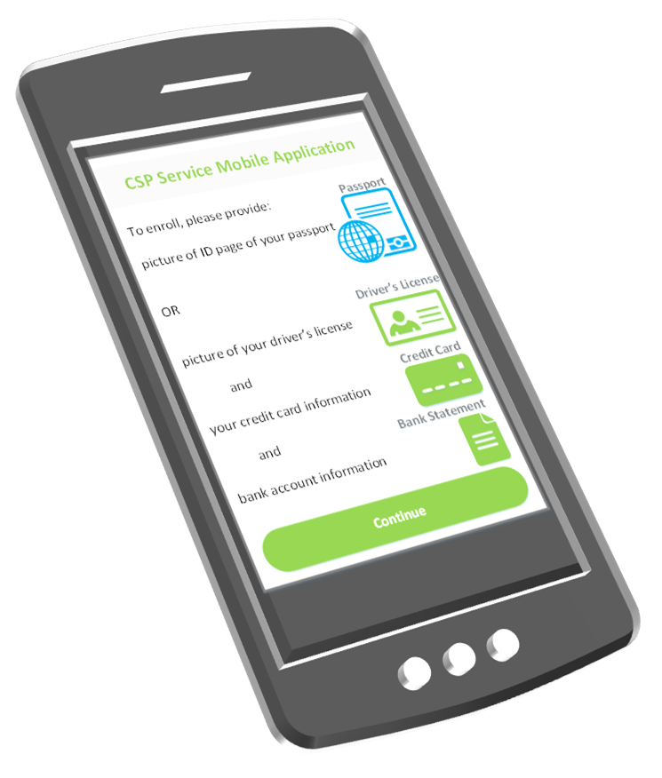

# Enrollment

>Paul: This remediates some of my earlier comments. Which ultimately begs the question regarding organization. Probably need to think thru structure as Section 2 is maybe overkill since the goodness is here.
>I am wondering why we don't have Resolution as one big section that includes this section. Enrollment is the result of proofing, not a specific step, so it may help to just state that. Or enrolling is executing the 3 steps while enrolled is the result.

The first step to proof an individual is to collect the core attributes necessary to establish a unique representation of the individual’s identity for use during the proofing process. The core attributes, regardless of IAL, should be collected in accordance with the requirements identified in SP800-63A.

While the information collected should be the minimum required by the CSP for its use in the proofing process, it is permissible for the CSP to collect additional information in the process of identity proofing an applicant, if the applicant explicitly consents to the CSP collecting and/or storing the attributes as outlined by the CSP. When attributes are not present within the collected evidence but require the CSP to query other data sources, the applicant’s explicit consent should again be sought.

CSP’s should also note that not all biographical data collected during the enrollment phase is used for enrollment. Some biographical attributes may in fact be evidence collected for the resolution phase that follows. The collection of these core attributes is intended to help the CSP resolve applicants to a single unique entity and to enable the appropriate level of verification and validation to support system risk. It is ultimately up to the CSP or agency to determine which biographic information to collect about an applicant. Some commonly used core attributes are listed in Table 3.

>Paul: I say we drop the table below. I also think you want to make a statement (if not made in future sections) that attributes on evidence collected do not have to be stored. For example, on my DL, they don't need to store if I am an organ donor. So just because they may have the data during proofing, they don't need to keep it. Of course, this is use case driven.

| Typical Core Attributes |
| --- |
| Name |
| Date of Birth |
| Address |
| Phone Number |
| Email Address |

**Table 3:** Typical Core Attributes

## Collection Techniques

During enrollment, CSP’s may use multiple techniques for collecting attributes **Paul: evidence or attributes or both?** in different media. These pertain to digital or other methods of collection that result in the transmission of information from the applicant to the CSP.  As noted earlier, while the processes laid out in this guide suggest multiple phases of collection, it is possible that agencies or CSPs could choose to collect core attributes, additionally required attributes, and evidence during the same event. Multiple techniques may also be combined based on agency requirements, user needs, and the overall approved proofing process flow.

### Digital

The initial information may be captured via an online form directly from the applicant that is being proofed.

In other cases, the CSP may allow the applicant to provide some documents via remote means, such as submitting an image of an identification document like a passport or a driver’s license. This workflow requires the utilization of some form of digital capture, such as a camera or a document scanner with a resolution higher than an acceptable threshold **Paul: this is the document to specify what that minimal is**. Systems with optical character recognition capabilities that allow fields in a document to be pre-populated upon scanning should also allow the applicant to review and validate the information as correct.

>Paul: this is another area that can be beefed up and less prosey. Here is a list of all the known ways to capture information...

| ***Example: U.S. Passport Pictures*** |
| --- |
|  The U.S. Department of State lists the following [requirements](https://travel.state.gov/content/passports/en/passports/photos.html) for a passport picture: <ul><li>Size of photo: 2  x  2 inches</li><li>Head must be between 1 and 1 3/8 inches from the bottom of the chin to the top of the head</li><li>Matte or glossy photo quality paper</li><li>Plain white or off-white background</li><li>Head must face camera directly with full face in view</li><li>Neutral expression or natural smile, both eyes open</li><li>In color</li><li>No glasses, hats, head covering, headphones</li><li>If own photo taken:</li><ul><li>Square aspect ratio</li><li>Dimensions between 600 x 600 and 1200 x 1200</li></ul></ul> |

>Paul: This table is not helpful unless we are making CSPs validate this information. Which is just one validation step. In other words, we have, like the list of physical and logical security features, we also want the CSP to check that the picture field is conformant to the appropriate standard. For example ICAO states for passwords - this list...

Some CSP’s may choose to enforce requirements more directly by providing mobile applications for collection –e.g. camera capture functions that provide an overlay and illumination check feature to ensure applicants provide pictures with correct size and brightness. In the Department of State example provided, the photograph is required to be submitted physically as a printed picture, but requirements are also provided for applicants that choose to collect and submit their own printed pictures after digitally creating them.

###	In-Person

> Paul: Not sure I understand the first statement. In addition, while this is just for resolution, we should provide some extra details. Do we want the user to enter or the operator? If operator, we want the user to validate before submission? Data entry should be limited as it could create errors that could result in failed validation (ie - data won't match in records).

If a CSP allows in-person registration, it may consider, for efficiency and convenience purposes, executing additional steps in the process, such as evidence validation, at the time of registration. The CSP may provide kiosks to allow applicants to enter their information directly. Alternatively, users may meet with a representative of the CSP to allow them to enter the applicant’s information on their behalf. Note—when this is done it is important the process is conducted in a manner that allows the individual to verify their information has been accurately captured and input into the collection system. Training should be provided for all CSP representatives to ensure that they are aware of organizational and federal policy concerning privacy and user experience. 

###	Paper Form

>Paul this is a subsection of in-person? If mailed in, how do we link the submitter to the submitted information in person or remote?

In the event an applicant does not have access to a connected device, is unable to use a computer, or otherwise wishes to submit the biographic information via a non-digital medium, they may complete a paper form instead. Written entry of information should be avoided if it is possible to capture information via multiple choice selections and the applicant should be instructed to print clearly to reduce inaccuracies resulting from the interpretation of handwriting. Some organizations require enrollment via paper form only in person while some implementations may allow the applicant to complete the form remotely and mail it in. It is also important to note that in many use cases applicants are asked to fill out a paper form with sensitive personal information and mail it to the requesting organization. Precautions should be taken minimize that risk and maintain transparency byinforming the individual of the risks while the paper form is in transit.

### Example: Evidence Selection and Enrollment

Assuming IAL2, the CSP e-mails applicants to inform them that enrollment can be done remotely using its secure mobile application through which the service or solution is delivered.

The landing page of the application, shown in the following figure, instructs the applicant to login or sign-up using email. A new applicant is instructed to provide either:

1.	Full name, address, DOB and a photograph of their US passport’s ID page, OR
2.	Full name, address, DOB, a photograph of their Driver’s License, the ABA/routing number and account number for a bank account and the name, number, expiration date and security code for a credit card.

>Paul: How is figure 4 applicable to this language?

**Figure 4:** Mobile Application's Document Instructions Page

The applicant is told explicitly that the passport and driver’s license images will be used for identity verification only, and once verified, document images will be deleted and not retained by the CSP. 

The CSP then requests a picture of the applicant’s passport to be uploaded using the mobile application, or a picture of their driver’s license in addition to credit card and bank account information. The applicant also providers full name, address and date of birth for registration. These tasks, as shown on the mobile application, are illustrated in the following figure.

Once enrollment is finished, the applicant is advised to await a confirmation message with 24 hours.

**Figure 5:** Document Capture in Enrollment

>Paul: hanging image and without description it is hard to determine if this image is helpful.
