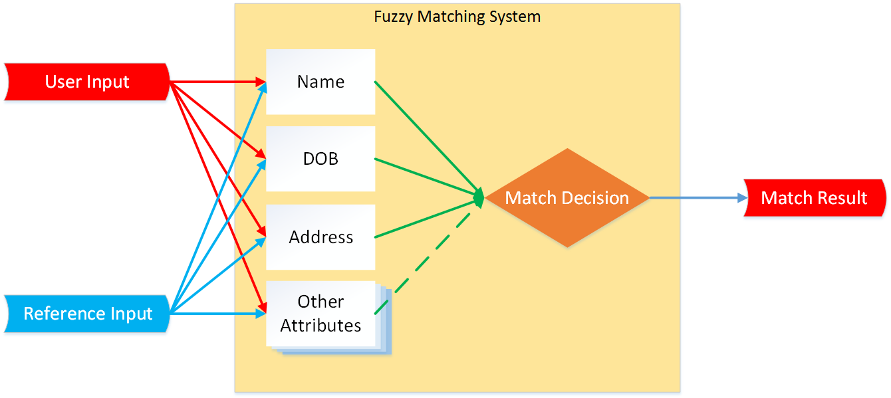

# Resolution

The goal of resolution is to map the information provided by the applicant into a unique, claimed identity. This process may be started automatically upon submission of biographic information during the enrollment process. The resolution process is focused on ensuring that the information being provided is representative of a real unique individual that can be distinguished from other records to enable the verification of associated attributes and identity evidence. It, in and of itself, is not intended to provide confidence that the individual presenting the information is who they claim to be.

Agencies should take into account factors specific to the populations that they serve, or intend to serve, to help design enrollment and proofing processes to allow for the collection of necessary information to uniquely distinguish between individual users—without collecting unnecessary sensitive information. As SP800-63A emphasizes, effective identity resolution uses the smallest set of attributes necessary to resolve to a unique individual. Where possible non-sensitive information should be added to collection if additional attributes are needed to help differentiate users. For example, a population of former military personnel will provide different details and require different resolution data sources than foreign nationals.

Sets and combinations of core and supplemental attributes provide varying levels of effectiveness, sensitivity, availability and reliability. An assessment of such metrics for core and supplemental identity attributes, e.g. name, address, date and place of birth, mother’s maiden name and gender, can be found in NASPO-IDPV-60 by the American Security Products Organization’s Identity Proofing and Verification (IDPV) working group (NASPO-IDPV-60. Establishment of Core Identity Attribute Sets and Supplemental Identity Attributes, Report of the IDPV Identity Resolution Project, Feb. 17, 2014). The analysis conducted in this study provides interesting results in terms of the effectiveness of combining attributes for resolution and also shows that there are diminishing returns to increasing the number of core attributes collected from applicants, as evidenced in Table 7. Organizations that seek a balance between the effectiveness of resolution and an increasing list of collected attributes can review such studies for information. Its inclusion here is not intended to endorse the IDPV standard, but instead illustrate how attribute sets may be balanced or combined to support resolution. 

| **Core Attributes** | *Set 1* | *Set 2* | *Set 3* | *Set 4* | *Set 5* |
| --- | --- | --- | --- | --- | --- |
| First Name | Y | Y | Y | Y | Y |
| Last Name |  | Y | Y | Y | Y |
| Middle Initial |  |  |  |  | Y |
| Full DOB |  |  | Y |  | Y |
| Partial DOB (YYYY or MMDD) |  | Y |  |  |  |
| Year of Birth | Y |  |  |  |  |
| Partial Address (Zip or City/State) |  | Y |  | Y |  |
| Full Address |  |  |  |  | Y |
| Last 4 Digits of SSN |  |  |  | Y | Y |
| Estimated Resolution Effectiveness (%) | 2.56 | 98.73 | 96.29 | 96.65 | 99.89 |

**Table 7:** Estimated Resolution Effectiveness for Various Attribute Combination Scenarios

To reduce inaccuracies and increase the efficiency of the resolution process, Agencies have historically employed knowledge based verification (KBV) or matching algorithms. We will be discussing matching algorithms here and discuss KBV in greater detail in the Verification section.

## Matching Algorithms

Matching algorithms produce a match outcome based on a comparison of personal information and proofing data. This match outcome can help the agencies determine whether the provided information can be resolved into a single identity reliably. Match algorithms provide a degree or level of confidence for the match outcome which needs to be taken into account by the agency when relying on the match algorithm’s certainty for resolution. Fuzzy matching algorithms perform contextual comparisons between fields of identity records and take into account factors such as name changes, misspellings, typographical errors, nicknames, variants, phonetic similarities and special characters and produce match outcomes that would otherwise not be captured in an exact comparison.

The uniqueness of the individual and the information presented impact the complexity of the resolution process. Statistically common names may require uniqueness beyond even Date of Birth, given the commonality of the name. 

| ***Example: Fuzzy Matching of Names*** |
| --- |
| A fuzzy matching algorithm may help the resolution of an identity record belonging to James A. Aldrin and data belonging to Jim Alvin Aldren to the same individual with a certain degree of confidence by taking into account that “Jim” is a variant of “James”, “A” is the first initial of “Alvin” and “Aldrin” could possibly have been misspelled as “Aldren,” if other data such as address, date of birth and place of birth all match. |

Another issue which requires close attention is the varying frequency of names across different languages and cultures. Compounding this complexity is the phonetic transformation of names from alphabets like Hangul (Korea), Hiragana (Japan), the Cyrillic and Arabic alphabets into English, which can frequently result in individuals with different names in their countries of origin having these different names transliterated into identical names in English. 

| ***Example: Common Last Names*** |
| --- |
| South Korea is a nation of approximately 50 million (2013). [As of the year 2000], a total of roughly 300 family names were in use in Korea and 54 percent of the population had one of the top five most commonly used family names. (*Source:* [Everything you ever wanted to know about Korean surnames](http://www.korea.net/NewsFocus/Culture/view?articleId=75090) Jacco Zwetsloot. KOREA.net, Aug. 12, 2009) |

Agencies should take care to check for uniqueness during registration. Fuzzy matching of attributes, if employed, also needs to be carefully assessed. Considerations should be made by the agency as to the confidence level associated with the outcome of a fuzzy match in terms of its applicability to the requirements of the specific level of assurance of the process. Fuzzy matching is effective only when the degree of confidence in the inexact match of a single attribute can be supported by the matching of additional attributes that belong to the same identity. In general, fuzzy matching tools involve a sequence of steps that align the attributes for proper matching, compare attributes from each source, and generate a confidence score, as shown in the following diagram.

**Figure 4:** Fuzzy Matching of Attributes Using Name, Date of Birth and Current Address

Depicted above, attributes from two sources are matched against each other, after which a combination of the match outcomes yields the final match confidence.

## Knowledge Based Verification for Resolution
If an agency chooses to start the identity proofing process with higher confidence, or in the event an identity cannot be resolved using automated matching algorithms or manual inspection by the agency staff, the agency may request the applicant participate in a KBV process. KBV is more commonly used in the verification step and a more detailed discussion of this process is provided in that section **[add link]**.

## Biometrics for Resolution

Biometric verification can also be used for identity resolution. Agencies can search the biometrics provided by an applicant against trusted data sources to obtain identity data for the applicant that can be matched against the applicant-provided identity data for a resolution.

In applications where the agency enrolls biometrics for applicants, the biometric samples collected should automatically trigger open-set identification. Open-set identification is typically defined as the task to determine if someone is in a database and to find the record of the individual in the database. This “defensive” first-line measure performs de-duplication. In other words, the agency's database of identities is surveyed automatically to see if the applicant has an existing identity record. If the deduplication search returns a positive match, agencies should match the attributes in the existing identity and the applicant-provided information to determine and adjudicate any mismatches. This can be considered as another method to perform identity resolution, as it aims to reduce variability in the identity information that belongs to an appicant.

