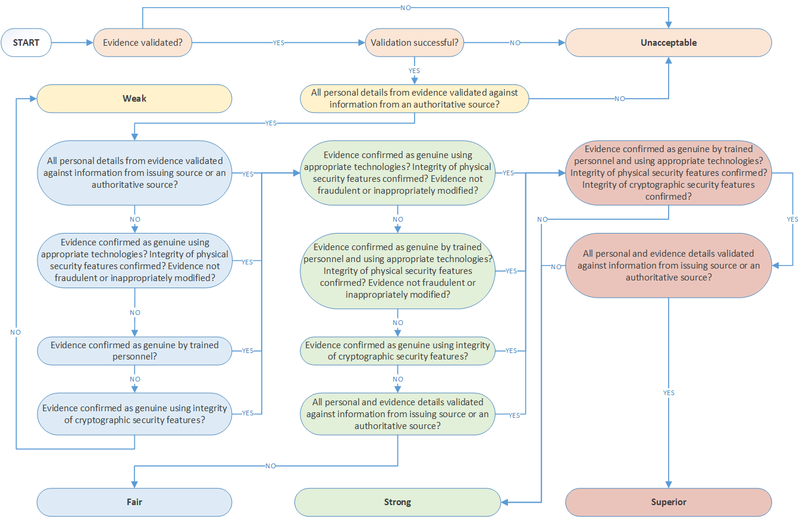

# Validation 
The goal of identity validation is to collect from the applicant the most appropriate identity evidence (for example, a passport or driver’s license) and determine its authenticity and accuracy. Regardless of identity assurance level, steps must be taken to validate the evidence to prevent an attacker from fraudulently completing the identity proofing process by presenting forged or modified evidence. 

## Validation Techniques

Identity validation is made up of two process steps: confirming the evidence is genuine and authentic, and confirming the data contained on the identity evidence is valid, current, and related to an actual, live individual. 

At IAL 2, agencies may allow applicants to present evidence digitally to facilitate remote proofing. Evidence presented in this manner will often be examined visually to determine if it appears fraudulent, counterfeit, or otherwise modified. The collection of evidence and validation of their authenticity may occur at the same time. For example, if an applicant provides a digital image of their driver’s license, the system accepting that image may be able to automatically read the ID number or barcode and perform a lookup in the issuing state’s motor vehicles department to confirm its authenticity.

Agencies should also examine the evidence visually. Techniques for remote validation should be comparable to in-person validation. Table 5-2 in SP800-63A describe methods for validating identity evidence at each strength.  

To determine whether the evidence is genuine, agencies should examine the security features of the provided evidence. These could be the physical or digital security features of a document or the cryptographically protected information contained within a physical document, or the cryptographically protected information within an electronic document. In each of these cases, methods such as the physical validation of the security features or electronic validation of the cryptographically protected content should be utilized to declare the evidence genuine or not. Table 3 provides examples of physical and digital security features.

To check if the identity evidence is valid, accuracy of the information such as that presented within the attributes should be confirmed with the issuing source, or machine-readable evidence such as passports or driver's licenses should be automatically validated by equipment used by the agency.

| **Feature** | **Description** |
| --- | --- |
| Holographic Security Threads | Incorporate diffractive surface elements with variable colors and patterns. They can also be equipped with machine-readable properties such as magnetic and electrical conductivity.  |
| Iridescent Inks and Custom Foil Stamping | Provide custom designs and prints that are dificult to duplicate. |
| Dynamic Fluorescent Feature | Dynamic response generated in UV light at varying distances from the source is hard to duplicate by attackers. |
| Ghosting | Design that produces a faint image of the card layout on top of the original layout, and used to promote visual security. |
| Integrated Circuit with PKI Protection | Asymmetric cryptography protects data content. |
| Digital Watermark | Documents signed by digital watermarking (DWM) (such as driver’s license images) can also be used by CSPs as a piece of strong evidence in identity proofing. Watermarks are embedded in images used in secure identity verification and use applications to verify the rightful owner of an evidence document. |
| Barcodes | Optical, machine readable, representation of data that is embedded on the document can be used to carry data and validate strong evidence by CSPs that wish to validate evidence. |
| Checksums | Checksums provide a method to validate electronic evidence, whereby CSP’s can generate cryptographic checks to associate with documents used as evidence, which are then subject to a check for validation. |
| Radio-frequency identification (RFID) | Transmits data to the surrounding vicinity upon is stimulated by a suitable radio frequency source. |
| Embedded holograms  | Unique optical properties that are used to diffract light and create virtual effects that render photocopying or scanning useless.  |
| UV and Infrared printing | A UV or infrared printed design that can only be viewed with special equipment.  |
| Microtext |  Very small field of static or variable data that can be confirmed when viewed under a magnifier |
| laser engraving | Burns data such as microtext, tactile data, perforated images, and variable images that change with different viewing angles. |
| Fluorescent ribbon | Print fluorescent grayscale text of images on ID cards that can only be seen by UV light.  |
| Magnetic stripes | Store data using magnetism and the modification of small iron particles that can be read by swiping past a magnetic reading head.  |

**Table 3:** Physical and Digital Security Features

Training of operators is also important for agencies to be able to expect and recognize the presence of a validating feature in a piece of evidence that normally carries it, and utilize specific knowledge or equipment to validate.

It is also important to make the distinction between equipment and knowledge that is the patented intellectual property of a particular vendor and is protected by patent law, and equipment and knowledge (algorithms, workflows, systems) that is proprietary to the vendor, whose internal working mechanisms are not known to outside entities that are not bound by non-disclosure agreements. Measures should be taken to ensure that proprietary systems and equipment produce results that are trusted by the agency.

## Validation Strength

When validating - agencies must do so consistent with the level of strength appropriate based on the strengh of the evidence. For example, a piece of evidence characterized as being "strong" evidence must be validated at the same level of strength. NIST SP 800-63A provides requirements at each strength level in Table 5-2; the following diagram provides a visual depiction of the decision process through which these requirements should be considered while determining the strength of evidence.

**Figure 1:** Evidence Validation Process

